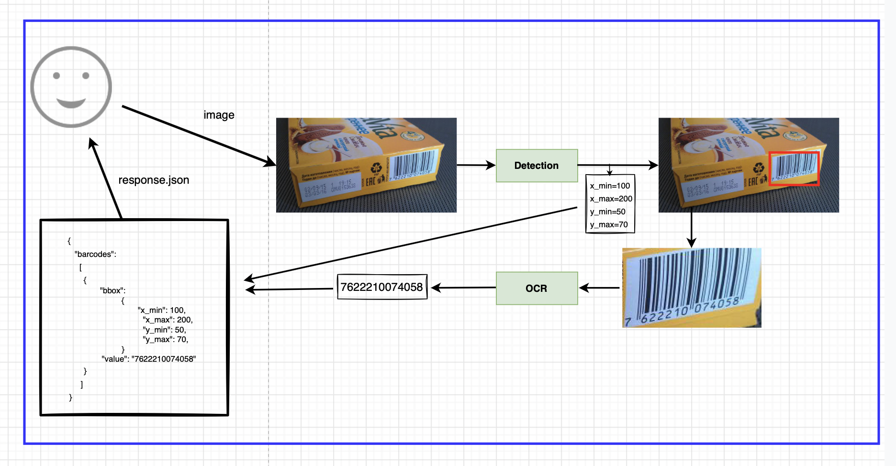

### Сервис для распознавания цифр на фотографиях штрих-кодов

Схема работы сервиса:

Репозиторий состоит из трех модулей:
1. [Сегментация штрих-кодов](segmentation)
2. [Распознавание цифр на маске штрих-кода](ocr)
3. [Fast API Сервис](service)
